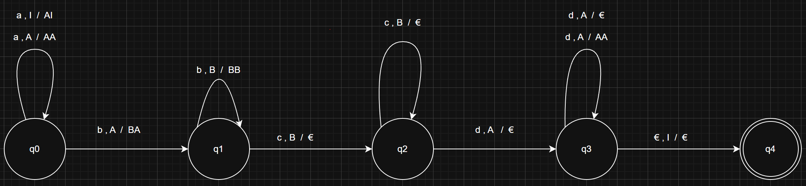
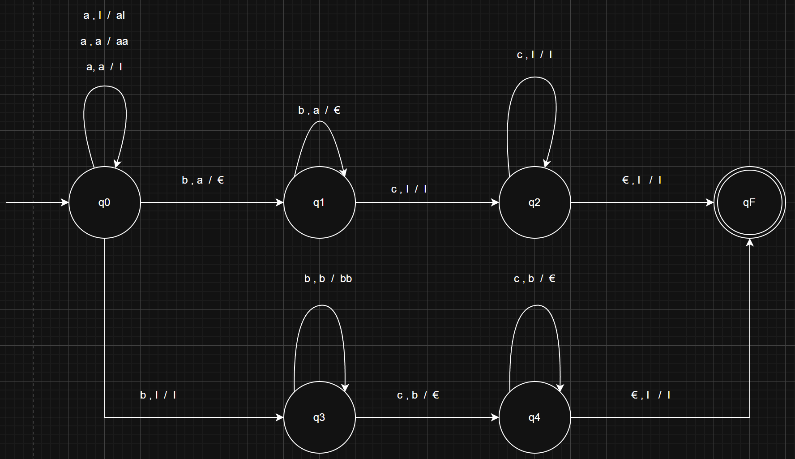

# Compilerbau-CFG-Dhanuka-Weerapperumage

## A2.1 PDA-Generieren

Die Vorgegebene Sprache lautet wie folgt:
L = { w € { a , b , c }* | w hat doppelt so viele a‘s wie c‘s }

Mein Ansatz:
Wenn das w doppelt so viele a’s haben soll wie c’s bedeutet:
Anzahl a = 2 * Anzahl c

Hier gibt es 2 Probleme:

Die Rheinfolge kann beliebig sein, bedeutet wir können zuerst a oder b oder c haben.

Wir müssen noch tracken wie viele c’s wir schon haben, da das Wort eine beliebige Rheinfolge haben kann ist es schwierig.

__Ich weiß nicht, wie ich in diese Aufgabe weiter gehen soll__

## A2.2 Akzeptierte Sprache

Folgende PDA ist nicht deterministisch, weil deterministisch in diesem Kontext bedeutet, dass der Automat bei jeder Eingabe und in jedem Zustand genau eine mögliche Lösung hat und es gibt keine Wahlmöglichkeiten oder alternative pfaden.

In den Regeln sieht man, wenn man eine d als eine Eingabe bekommt, gibt es zwei mögliche Übergangspfaden:

Übergangspfad 1 : Wenn man d als Eingabe ließt und das oberste Element das Stack ein A ist, soll der A vom Stacks gepopt werden.

Übergangspfad 2 : Wenn man d als Eingabe ließt und das oberste Element das Stack ein A ist, soll zwei A s in das Stack gepusht werden.

7 Tupel sieht wie folgt aus:

•	Q = { q0 , q1 , q2 , q3 , q4 }

•	∑ = { a, b , c, d }

•	Г = { т , A , B } 

•	q0 = Anfangszustand

•	Stack-Symbol = т

•	F = { q4 }

•	Δ = { All Regeln }

Welche Sprache generiert 

PDA :

 

## A2.3 Kontextfreie Sprache
Die Grammatik beschriebt eine if-else Anweisung, wie wir es aus den Programmiersprachen kennen. Dabei wird eine Fall Unterscheidung durchgeführt.
Mehrdeutigkeit bedeutet, dass man ein Satz auf zwei verschiedene Arten verstehen kann.
Also diese Grammatik ist mehrdeutig, weil wir haben, hier zwei if Anweisungen mit einem else teil und wir wissen es nicht genau, ob dieses else Teil auf welches if Anweisung gehört.

## A2.4 Kontextfreie Grammatik
Die Sprache sieht wie folgt aus
L = { a^i b^j c^k | i = j || j = k }
Mein Ansatz:
Den Teil mit „ i = j || j = k“ kann man auch so umschreiben:
I = J also :
I = j = n
a^n b^n c^k
Man bekommt a als die Eingabe, a wird auf Stack gepushed. Wenn b als Eingabe kommt, wird das Stack gepop. Beim c wird im Stack gar nicht gemacht.
Paar Beispiele : aabbccc , abcc

J = k also :
J = k = m
a^i b^m c^m
Beim a wird keine Stack Operationen durchgeführt. Beim b wird b auf das Stack gepushed. Beim c wird das Stack gepop.
Paar Beispiele : aaabc , abbcc

Da wir hier zwei Teile n und m haben, können wir hier zwei Hauptvariablen haben. Das CFG sieht dann wie folgt aus:
S -> S1 | S2
S1 -> aS1b | C
C -> cC | €
S2 -> AD
A -> aA | €
D -> bDc | €

PDA sieht so aus 

 

